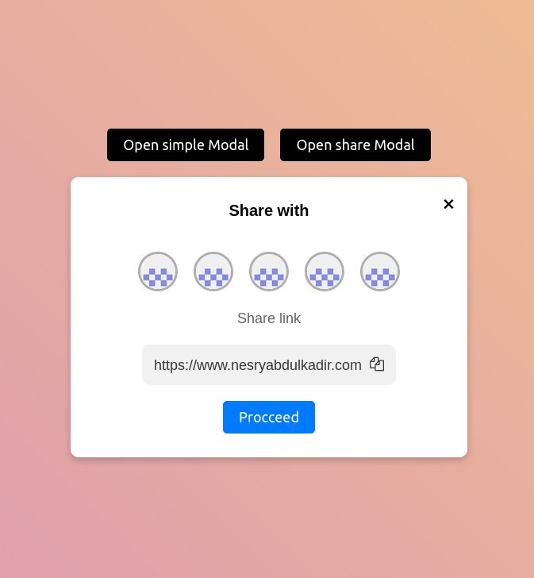

# Modal Window

## Description

A modal window is a pop-up window that appears on top of the main content of a website. It is used to display important information or to prompt the user for input.

## Technologies used

- HTML
- CSS
- JavaScript

## Screenshots

## Setup

- Download the files and open the index.html file.
- Click on the buttons to open the modals.

## Author

👤 **Nesrya Abdulkadir**

- Github: [@NesryaAbdulkadir](https://github.com/NesryaAbdulkadir)
